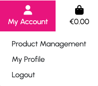

# Books Bazaar E-Commerce Store
## Milestone Project 5
The aim of this project is to build a full-stack web application using Django (the full-stack Python framework), HTML, CSS and JavaScript.
- This e-commerce web application is a fictional online book store.
- The functionality included in this web application includes, but is not limited to
    - An e-commerce store
    - Payments with [Stripe](https://stripe.com)
    - A book reviews area
    - A contact form for customer enquiries
    - Confirmation emails being sent to the user
    - CRUD functionality for the application admin users to manage products
    - An admin area for application admin users to manage book reviews, orders, users and view customer enquiries
        - I have included admin credentials in the project submission for assessors to log in
- This web application was built for educational purposes and no orders that are placed will be fulfilled.
- The Stripe payments implementation is set up for testing purposes only. No payments will be taken from users' accounts and users should not input their real debit or credit card details.
    - For completing purchases the below credit card details should be used:
        - Card number: 4242 4242 4242 4242 or 4000 0025 0000 3155 (Will prompt for purchase verification)
        - Any date in the future
        - Any CVV security number

## Live Project URL
The project has been deployed to Heroku and can be seen by opening [books-bazaar-08785163d42b.herokuapp.com](https://books-bazaar-08785163d42b.herokuapp.com/) in a web browser.

## Screenshots
### Homepage Hero with navigation and products
<div align="center"></div>

### Homepage Product Listings
#### Classics
<div align="center"></div>

#### Fiction
<div align="center"></div>

### Homepage Latest Reviews
<div align="center"></div>

## User Experience
### Epics
- [Website Structure](https://github.com/DanielleDaly/portfolio-project-5/issues/5)
- [Product Search](https://github.com/DanielleDaly/portfolio-project-5/issues/6)
- [Shopping Process](https://github.com/DanielleDaly/portfolio-project-5/issues/11)
- [User Account](https://github.com/DanielleDaly/portfolio-project-5/issues/18)
- [Website Owner Admin](https://github.com/DanielleDaly/portfolio-project-5/issues/21)

### User Stories
- Website Structure
    - [Homepage Website Intro](https://github.com/DanielleDaly/portfolio-project-5/issues/1)

        As a website user I can see an introduction to the website so that I can know more about what the website sells

    - [Website Navigation](https://github.com/DanielleDaly/portfolio-project-5/issues/2)    

        As a website user I can navigate through the website so that I can see the different products and pages within the website

    - [Contact Page](https://github.com/DanielleDaly/portfolio-project-5/issues/4)
    
        As a website user I can see a "Contact Us" page so that I can contact the company

    - [Interaction Notifications](https://github.com/DanielleDaly/portfolio-project-5/issues/17)
    
        As a website user I can see notifications of my interactions with the website so that I know what changes I have made or if I have placed an order, etc.

    - [Site Footer](https://github.com/DanielleDaly/portfolio-project-5/issues/35)
    
        As a website user I can see links to the most important parts of the site in the footer so that I can navigate through the site quickly

    - [Custom 404 Page](https://github.com/DanielleDaly/portfolio-project-5/issues/36)
    
        As a user I can see an error page when I go to a broken link so that I know that I should navigate back to a working page

    - [Company Information Page](https://github.com/DanielleDaly/portfolio-project-5/issues/3)
    
        NOT DONE - The website is self explanatory so there is no need for an About page. This is not a page always found on an e-commerce website

- Product Search
    - [All Products Listing](https://github.com/DanielleDaly/portfolio-project-5/issues/7)

        As a customer I can see a listing of all products so that I can view all of the website's products in one place

    - [Products by Category](https://github.com/DanielleDaly/portfolio-project-5/issues/8)

        As a customer I can search by category so that I can see products for only a specific category

    - [Search by Product Name](https://github.com/DanielleDaly/portfolio-project-5/issues/9)

        As a customer I can search by a product name (book title / stationary product name) so that I can find a specific product easily

    - [Sort Products by Price](https://github.com/DanielleDaly/portfolio-project-5/issues/10)

        As a customer I can list the products sorted by price so that I can see products listed in ascending or descending order by price

- Shopping Process
    - [Product Details](https://github.com/DanielleDaly/portfolio-project-5/issues/12)

        As a customer I can see the product details, description and image so that I know about the product before buying it

    - [Add Product to Shopping Cart](https://github.com/DanielleDaly/portfolio-project-5/issues/13)

        As a customer I can add a product to my shopping cart so that I can see it in the checkout

    - [Edit Shopping Cart](https://github.com/DanielleDaly/portfolio-project-5/issues/14)

        As a customer I can edit the contents of my shopping cart so that I can finalise the products that I want to purchase

    - [Checkout](https://github.com/DanielleDaly/portfolio-project-5/issues/15)

        As a customer I can checkout with the contents of my shopping cart so that I can receive my products

    - [Order Confirmation](https://github.com/DanielleDaly/portfolio-project-5/issues/16)

        As a customer I can receive confirmation of my order so that I know my order has been placed and what the contents of the order are

    - [Shopping Cart Total in Navigation](https://github.com/DanielleDaly/portfolio-project-5/issues/30)

        As a customer I can see my current shopping cart total so that I know the total cost of the items in my shopping cart

    - [Select the Size and Quantity of a Product](https://github.com/DanielleDaly/portfolio-project-5/issues/33)

        As a customer I can select the size and quantity of a product when making a purchase so that I can get the product variation that I want

    - [Enter My Payment Information Securely](https://github.com/DanielleDaly/portfolio-project-5/issues/34)

        As a customer I can enter my payment information securely during checkout so that I can feel that my payment card details are secure

- User Account
    - [User Details](https://github.com/DanielleDaly/portfolio-project-5/issues/19)

        As a customer I can save my details to an account so that I can see my details and details of orders I have placed

    - [Order Details](https://github.com/DanielleDaly/portfolio-project-5/issues/20)

        As a customer I can see my previous order details so that I know what I have purchased from the website in the past

    - [Register for a User Account](https://github.com/DanielleDaly/portfolio-project-5/issues/31)

        As a website user I can register for a User Account so that enter my details and view my orders

    - [Login and Logout](https://github.com/DanielleDaly/portfolio-project-5/issues/32)

        As a website user I can login and logout of my User Account so that I have secure access to my account

- Website Owner Admin
    - [Add / Edit Products](https://github.com/DanielleDaly/portfolio-project-5/issues/22)

        As a website owner / admin I can add and edit products easily so that I can manage what is available to purchase on the website

    - [Delete Products](https://github.com/DanielleDaly/portfolio-project-5/issues/23)

        As a website owner / admin I can delete products so that I can prevent customers from purchasing products that are no longer available

    - [Admin Area](https://github.com/DanielleDaly/portfolio-project-5/issues/24)

        As a website owner / admin I can access an admin area so that I can review products, orders, users and perform other administrative tasks

## Wireframes
- For the initial phase of design for the project I created wireframe layouts using [Balsamiq](https://balsamiq.com/). You can download these wireframes in PDF format but using the appropriate links below:
    - Desktop
        - Wireframe layouts for Desktop

    - Tablet
        - Wireframe layouts for Tablet

    - Phone
        - Wireframe layouts for Phone

## Database Models and Schema
### Models
- Users
    - User
        - From the Django Allauth package containing the username, email, and password
    - Userprofile
        - Model containing the user's details which can be re-used when placing future orders

- Products
    - Product
        - Contains the product information for each product item that is available in the store
    - Category
        - Contains the category information for products in the store

- Reviews
    - Contains the information for the Product Reviews

- Customer Enquiries
    - CustomerEnquiry
        - Contains the information for the Customer Enquiries submitted on the Contact Us page

- Checkout (Orders)
    - Order
        - Contains the information for an order, including the customer and the order contents
    - OrderLineItem
        - Contains the information on the individual line items in an order including the product and quantity

- Database Diagram
    - Below you will see the Database Diagram which shows the structure of the models in the database and the relationships between objects
    <div align="center"></div>

## Design
### Colour Template
The colours that I have used on the website were inspired by the [influence-society](https://www.influence-society.com/) website. Their colour pallette is modern, clean and accessible.

The monochrome pallette looks great with a single strong accent colour. This avoids any confusion for the user and allowed me to highlight specific page elements easily.

Within the site I have used the pink colour for areas that I want to stand out to users. This includes Call To Action buttons, such as the "Shop Now" and "Browse" category buttons, as well as for product titles.

I have also used the pink colour as the hover state for main navigation links.
<div align="center"></div>

### Typography
The font used on the website is called [Urbanist](https://fonts.google.com/specimen/Urbanist), which is designed by Corey Hu and is available from [Google Fonts](https://fonts.google.com).

I have used this font throughout the site to maintain consistency and build user trust.

Different font colours and weights are used to emphasise items of varying importance to the user.

<div align="center"></div>

### Images
Images are a very important element of the website as they help the user to quickly recognise products that they may already be familiar with.

Book covers are also meticulously designed to catch a potential reader's attention. Therefore I wanted to allow the strength of the book covers to do their job in selling the products.

All product images on the website were taken from [easons.com](https://easons.com). The hero image on the homepage was taken from [Unsplash](https://unsplash.com).

## Web Application Features
### Navigation
- Main Navigation
    - The main website navigation is situated at the top of every page.
    - On mobile devices the 3 visible links are "Search", "My Account" and the shopping bag, showing the current Shopping Bag Total. The links to the Homepage, Products, Reviews and Contact Us page are contained within a "Hamburger" menu.
    - On Desktop and larger devices, the links to  the Products, Reviews and Contact Us page immediately visible. A link to the homepage is also visible in the form of the shop logo "Books Bazaar".
    - When the user clicks on one of the Product navigation links, they will see a dropdown menu showing additional options, such as "All Products -> By Price", "Books -> Category" and "Stationery -> All Stationery".

### Footer
- Footer Links
    - The footer contains links to each of the most important sections of the website, which are Books, Stationery, Reviews, Contact Us.

- Newsletter Sign-up
    - The footer also contains a Newsletter Sign-up form and some text to encourage the user as to why they should sign up to the newsletter.

- Copyright Info
    - Finally, the footer contains the copyright information for the website. The year on the copyright information will update to show the current year automatically.

### Home App
- Hero Section
    - When a user opens the website on the homepage they will see the Hero section which clearly defines the intention of the site. They will quickly see that the site is a book store and they are immediately encouraged to start shopping.

- Product Category Sections
    - Immediately after the Hero section the user is shown 4 items from each of the product categories (Classics, Fiction, Non Fiction, Fantasy, Journals & Planners and Notebooks).
    - They are also encouraged to "Browse" these categories with a Call To Action button below the products in each category.

- Reviews
    - Just after the product categories the user can then see the 4 latest Product Reviews.
    - Again, the user is encouraged to "See All Reviews" by means of a Call To Action button just below the 4 reviews.

### Products App
- All Items
    - Shows all products available in the store
    - The number of products is displayed
    - Sorting options are available in the form of a dropdown giving ascending or descending ordering options by Price, Name, Author and Category.

    <div align="center"></div>

- Product Details
    - Shows the details about the product including Title, Price, Category, Author, Available in Hardback (if applicable), Number of Pages (if applicable) and Description.
    - There is also a Cover type selector (if applicable)
    - The Quantity Selector allows the user to order as many of the item as they with, with a limit of 99 items.
    - There are buttons to "Add To Bag", and a "Keep Shopping" button that brings the user back to the Products listing page.
    - Below the buttons is a link to "Get it on easons.com" which redirects the user to the product on the easons.com website, which opens in a new browser tab.

    <div align="center"></div>

- Super User View
    - If an admin user is logged into the website they will see some additional options when on a Product Details page.
        - Edit: This brings the user to the Edit Product page, where they can update the product details, including the product image.
        - Delete: This deletes the product from the store.

    <div align="center"></div>

### Shopping Bag App
- Add To Bag
    - Users have the option to add products to their Shopping Bag.
    - The user will be shown a message confirming that the product has been added to their shopping bag.
    - The confirmation message also lists all items in the shopping bag.
    - The user can navigate directly to their Shopping Bag by clicking the link in the confirmation message.
    - If the user's shopping bag total is below the "Free Delivery" threshold, the confirmation message will tell them how much more they would need to spend to get free delivery.

    <div align="center"></div>

- Shopping Bag page
    - The Shopping Bag page shows a list of all items in the user's shopping bag.
    - The user can adjust the quantity of each item in their bag, or choose to remove the items.
    - The total for each line item is shown to the user beside the quantity selector for that line item.
        <div align="center"></div>
    - At the bottom of the Shopping Bag page the user can see their Bag Total, Delivery and Total cost. They will also see the amount they need to spend to get Free Delivery.
    - Finally, there is a button to "Keep Shopping", as well as a button to go to the "Secure Checkout".
    <div align="center"></div>

### Checkout App
- Checkout Page
    - When the user is satisfied with their product choices they can proceed to the Checkout. This page can be reached by first going to the Shopping Bag page, and clicking the "Secure Checkout" button at the bottom of the page.
    - The checkout page shows the Checkout Form as well as the Order Summary, including the Order Total, Delivery costs and Total.
    <div align="center"></div>
    <div align="center"></div>
    - When the user enters their delivery and payment details, an overlay is displayed to prevent the user from taking any additional actions until the payment and order creation process is complete.
    <div align="center"></div>
    - Once payment is complete and the order has been created, the user is redirected to the Order Confirmation page showing the Order Number, Item List, Delivery Details and the Billing Info.

### Users
- Account
    - The navigation link will be updated to "Register / Login" or "My Profile / Logout" depending on whether the user is logged into the website of not.
    - Super Admin users will also see an additional navigation option "Product Management" when they are logged in.
    <div align="center"></div>

- Sign Up / Register
    - If the user does not already have an account, they can sign up using the link in the main navigation when they click on the "My Account" button.
    - The Sign Up page also displays a link to the "Login" page in case they landed on the Sign Up page accidentally and just want to log in with their existing account.
    <div align="center"></div>

- Sign In / Login
    - If the user already has an account, they can login on the Sign In page.
    - The Sign In page also displays a link to the "Register" page in case they landed on the Sign In page accidentally and want to register for a new account.
    <div align="center"></div>

- Profile Page
    - The user's Profile Page allows them to set their default shipping information as well as view a list of all of their previous orders on the website.
    - Clicking on an order in the list redirects the user to the Order Details page.
    <div align="center"></div>

- Order
    - The previous order page shows the details of the past order that the user clicked on in their User Profile.
    - The user will also be shown a notification to say that "This is a past confirmation for order number..."
    <div align="center"></div>

### Reviews App
- Reviews Listing Page
    - The reviews listing page shows a list of all product reviews available on the website.
    - Clicking on one of the reviews will bring the user to the review page.
    <div align="center"></div>

- Review Page
    - The product review page shows the product image, review title, what the review is and the review author.
    - Following the above detail is the review content.
    - Below the review there is a Call To Action button encouraging the user to "Buy Now", which redirects to the product page.
    - Finally, there is a link to "Read it on" the original review source website, or if the review is original content, it is indicated that it is "Original review content by" and the username of the website user who wrote the review.
    <div align="center"></div>

### Customer Enquiries
- Making a Customer Enquiry
    - Website users can make an enquiry using the form on the "Contact Us" page, which is linked in the main navigation and the footer.
    - When a user fills in the form and clicks "Send Enquiry" they will receive a notification message confirming that their enquiry was sent, as well as an expectation of when the website admins will respond to their message.
    <div align="center"></div>
    <div align="center"></div>

- Managing Customer Enquiries
    - Customer Enquiries are managed through the website admin area.
    - Since only website admins should see the contents of customer enquiries, it would not be viable, from a security point of view, to have a user-facing frontend built to handle enquiries.
    - However, this may be a consideration for the future if the admin area does not prove sufficient for handling enquiries.

## Technologies used.
- The application was built using the Django full-stack framework based on the Python programming language.
- For each section of the website a separate Django app was built.
- Each app has a views.py, urls.py file to create the pages and routes / URLs it requires.
- A models.py file is used to create the database models and migrations.
- On the apps that require a form, a forms.py file was created for handling these forms.
- The e-commerce payments are implemented using the [Stripe](https://stripe.com) payments system.
- The final website / application is deployed on Heroku.
- Static files and images are stored in Amazon AWS S3 buckets.

### Languages Used.
- [HTML5](https://en.wikipedia.org/wiki/HTML5)
    - HTML5 was used to create the structure, content and base layout of each page.

- [CSS3](https://en.wikipedia.org/wiki/CSS)
    - CSS3 was used to then style the pages and make it responsive through media queries. Some of the website interactions are enhanced using CSS transitions.

- [javaScript](https://en.wikipedia.org/wiki/JavaScript)
    - JavaScript is used within the website for interactivity purposes, including the product sorting dropdown, MailChimp Newsletter sign-up and Stripe payments.

- [Python](https://en.wikipedia.org/wiki/Python_(programming_language))
    - The backend functionality of the website is built using Python.

### Django and Django extensions used

- [Django](https://www.djangoproject.com/)
    - Django was used to build the project.

- [Django Allauth](https://django-allauth.readthedocs.io/en/latest/)
    - Django allauth was used to create the user sign-in functionality for the website / application.

- [Django Countries](https://pypi.org/project/django-countries/)
    - Django Countries was used for the "countries" select field in the Order and User Profile forms.

- [Django Crispy Forms](https://django-crispy-forms.readthedocs.io/en/latest/)
    - Django Crispy Forms were used to utilise the bootstrap form layouts and styling.

### Frameworks Libraries and Programs.

- [Stripe](https://stripe.com/ie)
    - Stripe was used for taking payments on the website.

- [Heroku](https://signup.heroku.com/)
    - The website / application was deployed on the Heroku platform.

- [Amazon AWS](https://aws.amazon.com/)
    - Amazon AWS S3 is used to store static files and images for the site.

- [Gunicorn](https://gunicorn.org/)
    - Gunicorn was used for deploying the project to Heroku.

- [Google Fonts](https://fonts.google.com/)
    - The font, Urbanist, used across the website is imported from Google Fonts.

- [Bootstrap 4](https://getbootstrap.com/)
    - Bootstrap 4 is used for its grid system, form inputs and its helper and utility classes.

- [Quick Database Diagrams](https://www.quickdatabasediagrams.com/)
    - Quick Database Diagrams was used to generate the database diagram.

- [Git](https://git-scm.com/)
    - Git was used as a version control system. All Git commands were written directly in the Terminal on VS Code.

- [Github](https://github.com/)
    - A GitHub repository is used as source control for the project's codebase.

- [Gitpod](https://gitpod.io/)
    - The workspace for the project is provided by GitPod. I used the [Code Institute Full Template](https://github.com/Code-Institute-Org/gitpod-full-template) as a template for this project.

- [Balsamiq](https://balsamiq.com/)
    - I have used Balsamiq Wireframes for the creation of the Wireframes which were used as the basis of the template layouts for the project.

- [Am I responsive](http://ami.responsivedesign.is/)
    - Responsive screenshots of the project were taken using AmIResponsive.

- [Markdown toc](http://ecotrust-canada.github.io/markdown-toc/)
    - Markdown toc was used to create my table of contents.

## Deployment
### GitHub, GitPod, Git, Heroku and Amazon AWS S3
- Project Setup
    - I used the [Code Institute Full Template](https://github.com/Code-Institute-Org/gitpod-full-template) as the base template for this project.
    - To use this template, locate it on the GitHub repository and click the "Use this template" button, and then select "Create a new repository" from the dropdown options.
    - Give your project a name that is unique within your GitHub account and create the repository.
    - Once the GitHub repository is created, it can be added as a Workspace in GitPod.
    - I made regular commits to the repository to ensure commits contained a single piece of logical work.

- App Deployment
    - To deploy the application to Heroku, I followed the steps below:
        - Create an App on my [Heroku Dashboard](https://dashboard.heroku.com/apps)
            -  Click the "New" button, then click "Create new app"
            - Give the app a name. This name must be unique.
            - Select the region closest to me (Europe)
            - Click "Create app"
        
    - Database was set up in ElephantSQL by following the steps below:
        - Logged in to ElephantSQL.com to access my dashboard
        - Clicked "Create New Instance"
        - Set up a new plan (Free Tiny Turtle)
        - Selected the region closest to me (EU-West-1 (Ireland))
        - Clicked "Review" and then "Create Instance"
        - I then returned to the ElephantSQL dashboard and clicked on the database instance name for this project
        - I then copied the "Database URL" for use later in the process
    
    - Connect the Database to the Heroku app
        - I went to the newly created app in Heroku
        - Clicked on the "Settings" tab and then clicked "Reveal Config Vars"
        - Add a new Key of "DATABASE_URL" and paste in the ElephantSQL database URL that I copied earlier as the Value.
    
    - Configure the new database in the project codebase
        - Install the required packages using 
        `pip3 install dj_database_url==0.5.0 psycopg2`
        - Freeze them to the requirements.txt file with `pip3 freeze > requirements.txt`
        - Import "import dj_database_url" in the settings.py file
        - Replace the existing database connection settings with
        ``` python
            DATABASES = {
                'default': dj_database_url.parse('DATABASE_URL')
            }
        ```
        > [!CAUTION]
        > DO NOT commit this file with your database string in the code, this is temporary so that we can connect to the new database and make migrations.
        - In the terminal, run the "showmigrations" command to confirm you are connected to the external database
        ` python3 manage.py showmigrations`
        - On seeing the list of migrations unchecked, it is safe to run the migrations with `python3 manage.py migrate`
        - Load in the "fixtures" in the correct order with `python3 manage.py loaddata categories` then `python3 manage.py loaddata products`
        - Create a database superuser with `python3 manage.py createsuperuser` and follow the prompts to create the user
        - Revert the changes to the database config in the "settings.py" file so that the live database connection details are not stored in the repository

    - Gunicorn
        - The app requires Gunicorn to be able to run. Install it with `pip3 install Gunicorn`
        - Create a "Procfile" to tell Heroku how to run the app with `touch Procfile`
        - In the Procfile, paste the following, replacing the <app_name> with the name of your app. In this case it is "books-bazaar"
            ```
            web: gunicorn <app_name>.wsgi:application
            ```

    - Heroku Python Version
        - The version that is running on Python apps on Heroku by default is earlier than the required version for sending emails over SMTP through Gmail.
        - To solve this issue it is required to create a file named "runtime.txt" at the project root to specify a later version of Python to run the Heroku app with.
        - Create the file "runtime.txt" in the root directory of your project and in the file paste the below:
            `python-3.9.19`
        - Commit and push this change to your GitHub repository

    - Log into Heroku in the Terminal with `heroku login -i`
        - If you get an error when you log into Heroku saying "IP Mismatch", then follow the steps on this [Stack Overflow answer](https://stackoverflow.com/questions/63363085/ip-address-mismatch-on-signing-into-heroku-cli/70632778#70632778) to resolve that issue.
        - Temporarily disable the collection of static files on Heroku with `heroku config:set DISABLE_COLLECTSTATIC=1 --app <app_name>`, using the `--app` flag if you have more than one App in your Heroku account. This will be reenabled later once the Amazon AWS S3 bucket is set up with the images and static files
        - Add the Heroku app URL into the "ALLOWED_HOSTS" of your "settings.py" file to allow access to your newly deployed app.
        `ALLOWED_HOSTS = ["<heroku app name>.herokuapp.com", "localhost"]`
        - Commit your changes to GitHub
        - Set up the remote connection to the Heroku repository with `heroku git:remote -a <heroku_app_name>`
        -Push the project to Heroku with `git push heroku main`, and Heroku will build your app
    
    - Set up automatic deploys on Heroku
        - Go to your app on Heroku and click on the "Deploy" tab
        - Search for your repository
        - Once found, enable automatic deploys and select the "main" branch
        - Now any time you push to the main branch, Heroku will automatically deploy the latest version of your app
    
    - Amazon AWS
        - Amazon AWS was used to store both static files and media files.
        - Firstly I created an AWS account and worked through the sign-up process. Once my account was set up I was able to set my project up on AWS.

        - Create S3 the bucket
            - First thing was to create a new bucket on the AWS S£ service.
            - From the main dashboard search for S£ and then click to get started.
            - Click on the Create bucket button.
            - Give the bucket a name and select your region.
            - Then uncheck the block public access and acknowledge that the bucket will now be public.
            - Then click create bucket.
    
        - Bucket settings
            - Properties
                - Navigate to the bucket properties settings.
                - Turn on static website hosting.
                - In the index and error add index.html and error.html.
                - Click Save.
            - Permissions
                - Click on the buckets Permissions tabs.
                - Firstly paste in the following cors config.
                ```
                [
                    {
                        "AllowedHeaders": [
                            "Authorization"
                        ],
                        "AllowedMethods": [
                            "GET"
                        ],
                        "AllowedOrigins": [
                            "*"
                        ],
                        "ExposeHeaders": []
                    }
                    ]
                ```
            - Then in the bucket policy tap, click on generate policy.
            - Policy
            - Select S3 bucket policy
            - Add * to the principal field to select all principals
            - Set the action to get object.
            - Paste in your ARN which is available on the previous page.
            - Click, add statement
            - Then click, generate policy.
            - Now copy and paste your new policy into the bucket policy.
            - Add /* onto the end of the resources key
            - Click Save.

        - Access control list
            - In the access control list tab set the list objects permission to everyone.
    
        - Create a User
            - To create a user for the bucket we need to use another Amazon service.
            - Back in the main dashboard search for IAM and select it.
     
        - Create a Group
            - Firstly we need to create a group to put our user in.
            - Click create a new group and name it.
            - Click through to the end and save the group.
        
        - Create a policy
            - In our group click, policy and then, create policy.
            - Select the JSON tab and then import managed policies.
            - Search S3 and select AmazonS3FullAccess and import.
            - In the resources section paste in our arn from before.
            - Click through to review the policy.
            - Fill in name and description and then click generate policy.
            - Back in your group click permission and then attach the policy.
            - Find the policy you've just created and attach it.

        - Create the User
            - Select Users from the sidebar and then click, add user.
            - Create a user name and select programmatic access then click next.
            - Then select your group to add your user to.
            - Click through to the end and then click create user.
            - **Make sure to now download the CSV file as it contains the users keys needed to access from our app.**

    - Connecting to Django
        - Once our AWS has been set up we now need to connect it to Django.
        - Firstly two packages are needed.
            - boto 3
            - Django storages
            ```
                pip3 install boto3
                pip3 install django-storages
            ```
        - Then add to our requirements.
            ```
                pip3 freeze > requirements.txt
            ```
        - We then add storages into our installed apps in settings.py
        - We then add the following settings to our settings.py
        - We create an environmental variable to only run this code when on Heroku. "USE_AWS"
            ``` python
                if "USE_AWS" in os.environ:

                    # Bucket Config
                    AWS_STORAGE_BUCKET_NAME = '<bucket name>'
                    AWS_S3_REGION_NAME = '<your region>'
                    AWS_ACCESS_KEY_ID = os.environ.get('AWS_ACCESS_KEY_ID')
                    AWS_SECRET_ACCESS_KEY = os.environ.get('AWS_SECRET_ACCESS_KEY')
                    AWS_S3_CUSTOM_DOMAIN = f'{AWS_STORAGE_BUCKET_NAME}.s3.amazonaws.com'

                    # static and media file storage
                    STATICFILES_STORAGE = 'custom_storages.StaticStorage'
                    STATICFILES_LOCATION = 'static'
                    DEFAULT_FILE_STORAGE = 'custom_storages.MediaStorage'
                    MEDIAFILES_LOCATION = 'media'

                    # Override static and media URLs in production
                    STATIC_URL = f'https://{AWS_S3_CUSTOM_DOMAIN}/{STATICFILES_LOCATION}/'
                    MEDIA_URL = f'https://{AWS_S3_CUSTOM_DOMAIN}/{MEDIAFILES_LOCATION}/'
            ```
        - Then back in Heroku we click the settings and reveal config vars.
        - Then set up the environmental variables needed.
        - We then create a custom_storages.py to tell Django that in production we want to use s3 to store our static and media files.
        - We Firstly need to import S3Boto3Storage.
        - then we set up our new classes to tell Django where to store the files.
            ``` python
                class StaticStorage(S3Boto3Storage):
                    location = settings.STATICFILES_LOCATION


                class MediaStorage(S3Boto3Storage):
                    location = settings.MEDIAFILES_LOCATION
            ```
    - Once all the settings are done we can now push to GitHub and Heroku

    - Add our media to AWS
        - The final step is to add our media to AWS.
        - In your bucket create a new folder called media.
        - Select upload and add your image files.
        - Then select to grant public access.
        - And then upload the files.

## Setting up locally
  - To set the project up locally you can follow these steps.
    - Download a copy of the repository from Github using the Download Zip option in the code dropdown.

      <div align="center"></div>
    
    - Then extract the zip file to local machine.

    - Alternatively, you can clone it into your repository using the following command.
        ```
        git clone https://github.com/DanielleDaly/portfolio-project-5.git
        ```
    
    - Once you have created the repository you can now download the requirements by running the following command:
        ```
        pip3 install -r requirements.txt
        ```
    
    - You must then set up the following environment variables to use the full functionality of the site.
        - DANGO_SECRET_KEY = your secret key.
        - STRIPE_PUBLIC_KEY = your stripe public key.
        - STRIPE_SECRET_KEY = your stripe secret key.
        - STRIPE_WEBHOOK_SECRET = your stripe webhook secret.
        - DEVELOPMENT = True
        - Your stripe variables can be found on your stripe dashboard.
        - You can generate a Django secret key here. [Django Secret Key Generator](https://miniwebtool.com/django-secret-key-generator/)
    
    - You will then need to migrate the database models to set up your database.
        - Check first
            ```
                python3 manage.py makemigrations --dry-run
            ```
        -  Then make migrations.
            ```
                python3 manage.py makemigrations
            ```
        - Check the migration plan
            ```
                python3 manage.py migrate --plan
            ```
        - Then finally migrate
            ```
                python3 manage.py migrate
            ```

    - Then create your superuser to access the admin section.
        ```
        python3 manage.py createsuperuser
        ```
        - Follow the prompts.

    - Once these steps have been followed you can then run the project by using the following command.
        ```
            python3 manage.py runserver
        ```

## Credits
### Content
- Product images and details
    - I used [easons.com](https://easons.com) for sourcing all images and product details. I have added the "Get it on easons.com" links to the product pages as a means of giving credit.

- Product reviews
    - Some of the product reviews are taken from [The Guardian](https://www.theguardian.com) website. I have added the "Read it on The Guardian.com" links to the review pages as a means of giving credit.

- Homepage Hero image
    - The homepage hero image is from [Unsplash.com](https://unsplash.com). I have made some adjustments to the image.

### Deployment Steps
- The steps taken to deploy the project on Heroku, ElephantSQL and Amazon AWS were taken from the Code Institute lessons, as well as the [AWS Changes Sheet](https://codeinstitute.s3.amazonaws.com/fullstack/AWS%20changes%20sheet.pdf) that is linked in the lessons

### General Issues
- Heroku "IP Address Mismatch" issue
    - I found there was an issue when logging into Heroku on the Terminal. I found the solution to the issue on [StackOverflow](https://stackoverflow.com/a/70632778)

- Sending emails from Heroku
    - There was an issue with sending emails over SMTP through Gmail from Heroku caused by the Python version that Heroku assigns by default for apps.
    - John in Code Institute helped me solve the problem by adding a "runtime.txt" file to the project requiring that Python 3.9.19 is used.

    <div align="center"></div>

