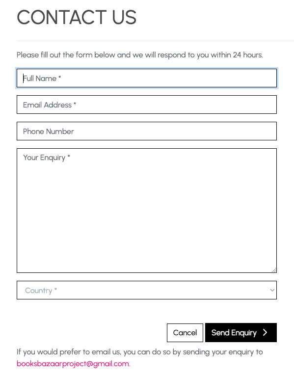
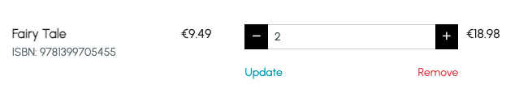
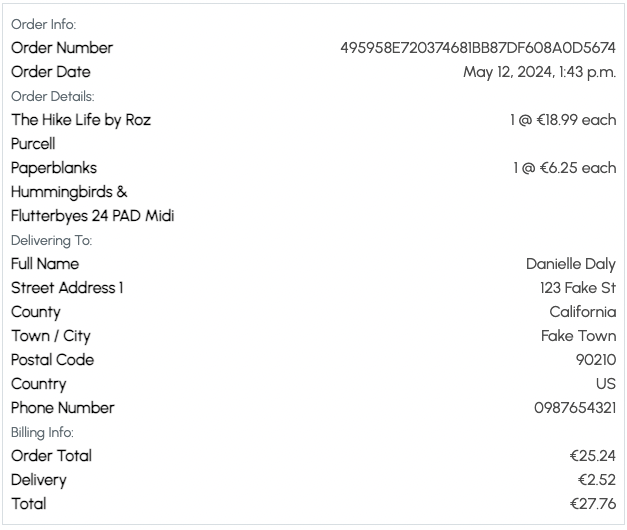

# Testing
## User Stories
### Website Structure
- [Homepage Website Intro](https://github.com/DanielleDaly/portfolio-project-5/issues/1)

As a website user I can see an introduction to the website so that I can know more about what the website sells

- The user is immediately presented with an image of a book store and text to encourage them to browse the collections of books and stationery.
- The large "Shop Now" button tells the user that they can purchase these books and stationery products.

- [Website Navigation](https://github.com/DanielleDaly/portfolio-project-5/issues/2)    

As a website user I can navigate through the website so that I can see the different products and pages within the website

- All navigation links on the website have been clicked and tested that the URLs redirect the user to the correct page.

- [Contact Page](https://github.com/DanielleDaly/portfolio-project-5/issues/4)

As a website user I can see a "Contact Us" page so that I can contact the company

- There is a link in the main navigation and the footer to the "Contact Us" page where a Customer Enquiries form is clearly visible. There is also a text prompt containing the email address should the user wish to send an email directly instead of filling out the form.

- [Interaction Notifications](https://github.com/DanielleDaly/portfolio-project-5/issues/17)

As a website user I can see notifications of my interactions with the website so that I know what changes I have made or if I have placed an order, etc.

- There are clear notification messages telling the user when certain interactions have taken place on the website. These include, but are not limited to:
    - Order confirmation
    - Customer Enquiry sent notification
    - Sign In success
    - Signed out success
    - Product added to / removed from Shopping Bag

- [Site Footer](https://github.com/DanielleDaly/portfolio-project-5/issues/35)

As a website user I can see links to the most important parts of the site in the footer so that I can navigate through the site quickly

- There is a footer at the bottom of every page on the website with links to the main parts of the website, as well as a Newsletter Sign-up form.
- All links and functionality has been tested and confirmed that they are working as expected.

- [Custom 404 Page](https://github.com/DanielleDaly/portfolio-project-5/issues/36)

As a user I can see an error page when I go to a broken link so that I know that I should navigate back to a working page

- When entering a URL that does not have a corresponding page on the website, a 404 "Page not found" page is shown.
- This error page gives an appropriate message and a large button suggesting that the user redirects to the homepage.
- This has been tested with [https://books-bazaar-08785163d42b.herokuapp.com/testing404](testing404), but any link that does not exist on the website will arrive at the same error page.

### Product Search
- [All Products Listing](https://github.com/DanielleDaly/portfolio-project-5/issues/7)

    As a customer I can see a listing of all products so that I can view all of the website's products in one place

    - The "All Products" page shows all of the products from all categories.
    - This has been tested against the list of products in the Admin area.

- [Products by Category](https://github.com/DanielleDaly/portfolio-project-5/issues/8)

    As a customer I can search by category so that I can see products for only a specific category

    - This page has been tested and displays all products sorted by category name in ascending order

- [Search by Product Name](https://github.com/DanielleDaly/portfolio-project-5/issues/9)

    As a customer I can search by a product name (book title / stationary product name) so that I can find a specific product easily

    - The search bar functionality has been tested and returns a list of all products that match the search query either in the product name or product description. [Search results page](https://books-bazaar-08785163d42b.herokuapp.com/products/?q=great).

- [Sort Products by Price](https://github.com/DanielleDaly/portfolio-project-5/issues/10)

    As a customer I can list the products sorted by price so that I can see products listed in ascending or descending order by price

    - This page has been tested and displays all products sorted by price in ascending order

### Shopping Process
- [Product Details](https://github.com/DanielleDaly/portfolio-project-5/issues/12)

    As a customer I can see the product details, description and image so that I know about the product before buying it

    - This page has been tested and all relevant details are present.
    - All page functionality works as expected.
    

- [Add Product to Shopping Cart](https://github.com/DanielleDaly/portfolio-project-5/issues/13)

    As a customer I can add a product to my shopping cart so that I can see it in the checkout

    - This has been tested and the products can bee seen in the Shopping Bag
    

- [Edit Shopping Cart](https://github.com/DanielleDaly/portfolio-project-5/issues/14)

    As a customer I can edit the contents of my shopping cart so that I can finalise the products that I want to purchase

    - This functionality has been tested and confirmed that it is working correctly.

- [Checkout](https://github.com/DanielleDaly/portfolio-project-5/issues/15)

    As a customer I can checkout with the contents of my shopping cart so that I can receive my products

    - This functionality has been tested and confirmed that it is working correctly.
    

- [Order Confirmation](https://github.com/DanielleDaly/portfolio-project-5/issues/16)

    As a customer I can receive confirmation of my order so that I know my order has been placed and what the contents of the order are

    - This functionality has been tested and confirmed that it is working correctly.
    

- [Shopping Cart Total in Navigation](https://github.com/DanielleDaly/portfolio-project-5/issues/30)

    As a customer I can see my current shopping cart total so that I know the total cost of the items in my shopping cart

    - This functionality has been tested and confirmed that the Shopping Bag total is in the navigation.
    

- [Select the Size and Quantity of a Product](https://github.com/DanielleDaly/portfolio-project-5/issues/33)

    As a customer I can select the size and quantity of a product when making a purchase so that I can get the product variation that I want

    - This functionality has been tested and confirmed that the Quantity Selector and Product Variant Selector are working as expected.
    - The product variant selector is only available in products that are "Available in Hardback". The book cover variants are "Hardback" and "Softback".
    - The product categories that are available in hardback are "Classics" and "Non Fiction".

- [Enter My Payment Information Securely](https://github.com/DanielleDaly/portfolio-project-5/issues/34)

    As a customer I can enter my payment information securely during checkout so that I can feel that my payment card details are secure

    - This functionality uses the [Stripe](https://stripe.com) payment gateway which is a globally recognised payment system that is trusted by users worldwide.
    - The payment functionality has been tested.
    

### User Account
- [User Details](https://github.com/DanielleDaly/portfolio-project-5/issues/19)

    As a customer I can save my details to an account so that I can see my details and details of orders I have placed

    - This functionality has been tested and is working as expected

- [Order Details](https://github.com/DanielleDaly/portfolio-project-5/issues/20)

    As a customer I can see my previous order details so that I know what I have purchased from the website in the past

    - This functionality has been tested and is working as expected
    

- [Register for a User Account](https://github.com/DanielleDaly/portfolio-project-5/issues/31)

    As a website user I can register for a User Account so that enter my details and view my orders

    - User registration has been tested and is working as expected.

- [Login and Logout](https://github.com/DanielleDaly/portfolio-project-5/issues/32)

    As a website user I can login and logout of my User Account so that I have secure access to my account

    - User Sign In / Sign Out has been tested and is working as expected.

### Website Owner Admin
- [Add / Edit Products](https://github.com/DanielleDaly/portfolio-project-5/issues/22)

    As a website owner / admin I can add and edit products easily so that I can manage what is available to purchase on the website

    - The website product management functionality has been tested and is working as expected.
    - The functionality tested includes:
        - Add a product
        - Edit a product

- [Delete Products](https://github.com/DanielleDaly/portfolio-project-5/issues/23)

    As a website owner / admin I can delete products so that I can prevent customers from purchasing products that are no longer available

    - The website product delete functionality has been tested and is working as expected.

- [Admin Area](https://github.com/DanielleDaly/portfolio-project-5/issues/24)

    As a website owner / admin I can access an admin area so that I can review products, orders, users and perform other administrative tasks

    - The Admin Area has been tested and all expected functionality is available to admin users.
    - Access to the admin area for non admin users was also tested and the appropriate message is displayed.
    - The admin area can be accessed [here](https://books-bazaar-08785163d42b.herokuapp.com/admin/)

## Defensive Programming and Security
### Security
- Environmental variables
    - For security reasons standard practices have been followed by using os to declare environmental variables for any sensitive information.
    - For Development, these variables are declared in the settings section of gitpod.
    - In doing this it means that sensitive information such as passwords and secret keys are not publicly accessible.
    - To deploy on Heroku these environmental variables are also placed into the settings, config vars section.

- Users passwords.
    - User sign-up is managed by Django AllAuth, which is a tried and trusted authentication package for the Django framework.
    - Passwords are saved as a hashed key for security purposes.
    - User email verification is required by new users when registering.
    
### Defensive Programming.        
- Appropriate actions are taken if a user attempts to access URLs or functionality that they should not have access to. 

- If for instance the user types in the URL to delete a post the application has been programmed to redirect the user elsewhere and show an appropriate error message. 

- This functionality has been tested, by typing the URLs into the browser, and can confirm that it works as expected.

## Manual Testing
All functionality on the website has been tested manually and is working as expected.

### Shopping Bag Functionality
Steps employed in testing the Shopping Bag functionality:
- Add a product to the bag
- Navigate to the Shopping Bag page
- Update the product quantity
- Remove the item from the bag

### Checkout Functionality
Steps employed in testing the Checkout functionality:
- Add a product to the shopping bag
- Navigate to the Checkout page
- Input details on the Checkout form, leaving out some of the required fields to check validation
- Input the remaining required fields
- Enter payment details
    - Card number: 4242 4242 4242 4242
    - Expiry date: 02/25
    - CVC number: 123
- Click "Complete Order" and observe
- Check that the payment was processed in Stripe Dashboard
- Check that the Stripe Payment ID matched the PID in the order in the Admin Area of my application

### Website Admin Functionality
To test the Website Admin functionality, I logged in as an Admin user.

#### Add Product
Steps employed in testing the Add Product functionality:
- Navigate to the Product Management URL from the link in the main navigation
- Input the new product details
- Save the product
- Observe that I have been redirected to the new product's URL and all details are correct
- Observe the notification that the new product has been added

#### Edit Product
Steps employed in testing the Edit Product functionality:
- Navigate to the Product Edit by clicking "Edit" on a product details page
- Edit the product details (Title, description and price)
- Save the product
- Observe that I have been redirected to the product's URL and all details are correct
- Observe the notification that the new product has been edited

#### Edit Product
Steps employed in testing the Delete Product functionality:
- Navigate to the Product Details page
- Click the "Delete" button at the bottom of the product details section
- Observe that I have been redirected to the "All Products" page and the product is no longer available
- Observe the notification that the new product has been deleted
- Check the product listing in the Admin Area to make sure the product has been fully deleted from the database
- Try searching for the product on the website using the Search bar and observe that the product is not in the search results

### Reviews Functionality
Steps employed in testing the Reviews functionality:
- Add a new Review in the Admin Area
- Navigate to the Reviews section of the website
- Observe that the new review is available on the Reviews page
- Observe that the new review is available on the latest Reviews section on the Homepage
- Click on the Review and observe that the review is readable

### Customer Enquiry Functionality
Steps employed in testing the Customer Enquiry functionality:
- Navigate to the Contact Us page on the website
- Fill out the Customer Enquiry form
- Observe the notification that my enquiry has been submitted and that the website admin will contact me within 24 hours
- Observe that the new enquiry is visible in the Customer Enquiries section of the Admin Area

### Newsletter Sign-up Functionality
Steps employed in testing the Newsletter Sign-up functionality:
- Scroll down to the Footer of any page on the website
- Enter my email address and click "Sign Up"
- Observe the notification that thanking me for signing up
- Check the "Audience" list in MailChimp and observe that the email address is listed in the account

## Validators
### HTML
I passed my CSS through the [HTML code validator](https://validator.w3.org/nu/) and there were no errors found

### CSS
I passed my CSS through the [CSS code validator](https://jigsaw.w3.org/css-validator/) and there were no errors found

### Python
I tested my python code with the Flake8 validator and there were no issues found apart from some line length issues, which is a preference that can be set in the [setup.cfg](/setup.cfg) file and is not an error

## Browser Responsiveness Testing
I tested the website for responsiveness across a number of devices and browsers.
Testing was carried out using the Chrome DevTools responsive option.

The browsers I tested the website on were:
- Chrome
- Firefox
- Safari
- Edge
- Brave Browser

I tested the website at the different Bootstrap breakpoints as well as by dragging the screen width to test sizes in between breakpoints.

## Accessibility
- The site has been tested for Accessibility using Google Chrome Lighthouse.
- After testing I made a number of changes including updating heading tags to be in the correct order, as well as adding the appropriate ARIA labels to elements.
- All images have descriptive alt tags.
- Lighthouse testing has returned scores of 96% to 100% across the site.

